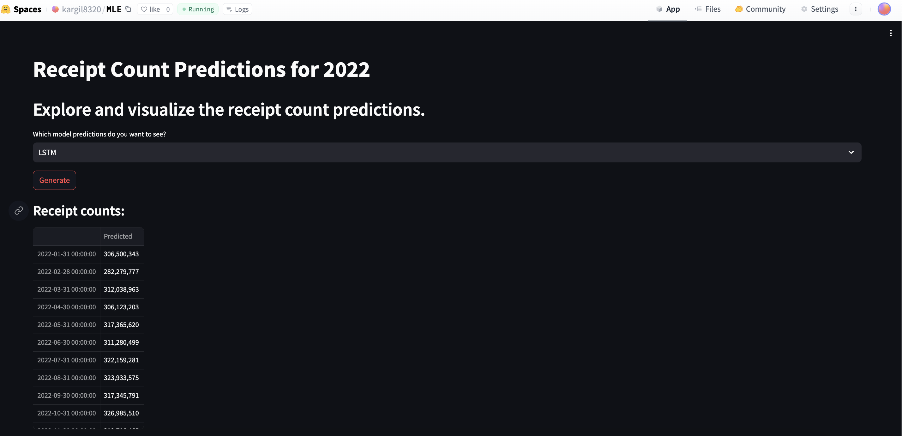
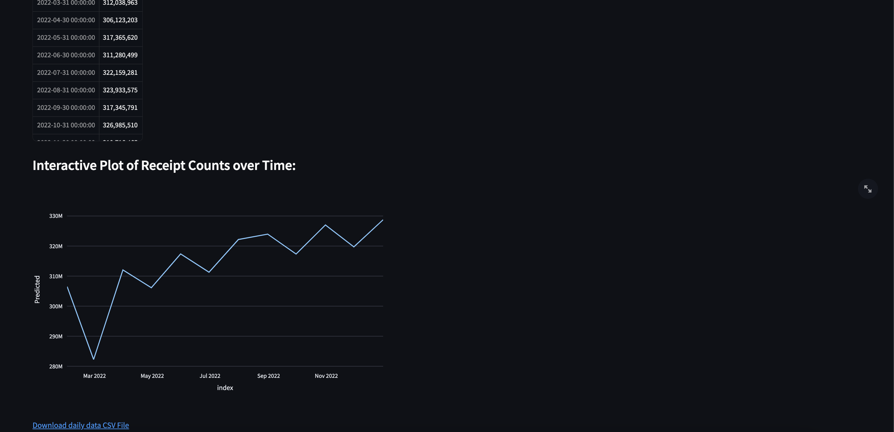

# FetchMLE

## Problem Statement

At Fetch, we closely monitor the number of scanned receipts in our app on a daily basis, as it serves as a crucial Key Performance Indicator (KPI). In certain business scenarios, it becomes essential to predict the potential number of scanned receipts for a given future month.

The provided dataset contains the observed number of scanned receipts each day throughout the year 2021. The goal is to develop an algorithm capable of predicting the approximate number of scanned receipts for each month in 2022.

## Inference Deployment

The inference process is deployed on Hugging Face, which provides a convenient platform for interaction. You can access the inference platform here -

https://huggingface.co/spaces/kargil8320/MLE 

Note that due to resource limitations on the free Hugging Face platform, the deployed app pauses every 48 hours. If you encounter any issues, consider restarting it.

App screenshots - 




For a more robust inference experience, you can pull the Docker image from the following repository:

```bash
docker pull tkargil0/receiptpredictor:latest
```

This Docker image includes the complete pipeline, including model training, prediction generation, and a Streamlit app for visualization.

## Modelling Approach

Given the limited features in the dataset, additional features were engineered based on the date, including month, day, days in the month, etc. The dataset for the year 2021 was divided into training and testing sets using a 75-25 split.

Three distinct modeling approaches were employed to address this prediction task:

### 1. Linear Problem - Linear Regression using OLS

- **Data Preparation:** The dataset was preprocessed by creating additional date-related features.
- **Model Training:** Linear Regression using Ordinary Least Squares (OLS) was employed for training.
- **Evaluation:** The model was evaluated using Root Mean Squared Error (RMSE) and Mean Absolute Error (MAE).
- **Prediction:** The model was used to predict the number of scanned receipts for each month in 2022.

### 2. Time Series Problem - Facebook Prophet Model

- **Data Preparation:** The dataset was split into training and test sets for time series modeling.
- **Model Training:** A time series model using Facebook Prophet was fitted to the training data.
- **Evaluation:** The model's performance was evaluated using RMSE and MAE.
- **Prediction:** Predictions were generated for each day in 2022.

### 3. Non-Linear Problem - LSTM Model

- **Data Preparation:** Date features were engineered, and the dataset was split into training and test sets.
- **Model Training:** A Long Short-Term Memory (LSTM) neural network was created and trained using a grid search for hyperparameter tuning.
- **Evaluation:** The LSTM model's performance was evaluated using RMSE.
- **Prediction:** Monthly predictions for 2022 were obtained using the trained LSTM model.

Each method offers a unique perspective on predicting scanned receipts, catering to different aspects of the underlying patterns in the data. The results and predictions can be visualized through the provided Hugging Face inference platform or by running the Docker image locally.

### Project Structure

- **Dockerfile:** This file contains instructions for building a Docker.

- **README.md:** This is the documentation file for the project.

- **data/:** This directory stores data files used by the project. It includes daily data (`data_daily.csv`) and prediction files (`lr_predictions.csv`, `lstm_predictions.csv`, `prophet_predictions.csv`) generated by different models.

- **main.py:** This is the main script that executes the entire workflow of the project. It loads, preprocesses, trains models, generates predictions, and saves results.

- **models/:** This directory holds saved model files (`LSTM.pkl`, `LinearRegression.pkl`, `Prophet.pkl`). These files store the trained models for future use.

- **requirements.txt:** This file lists the dependencies required to run the project. 

- **src/:** This directory contains the project's source code. The `__pycache__/` subdirectory stores compiled Python files. `utils.py` likely contains utility functions used throughout the project.

- **streamlit/:** This directory contain files related to your Streamlit app. `app.py` is the main script for the Streamlit application.

- **tests/:** This directory holds the unit tests. The `__pycache__/` subdirectory stores compiled Python files. `test_utils.py` contains tests for the utility functions in `utils.py`.

### About Unit Tests

- **test_utils.py:** This file includes unit tests for the utility functions defined in `utils.py`. Unit tests help ensure that each function in your utility module behaves as expected. They are crucial for maintaining code quality and catching regressions during development.

### About Utils Functions

- **utils.py:** This module contains utility functions used across different parts of your project, such as data loading, preprocessing, and evaluation. These functions are designed to be reusable and modular, promoting good code organization and maintainability.

### About Dockerfile

- The Dockerfile provided in this project sets up a lightweight Python environment using the official Python 3.10 slim image. It installs project dependencies from the requirements.txt file, copies the project files into the container, and exposes port 8502. The health check is configured to ensure the application's health using an HTTP request. Upon container startup, it runs unit tests, executes the main.py script, and launches the Streamlit app on port 8502, ready for deployment.

### About Streamlit app

- The Streamlit app in this project provides an interactive interface for exploring and visualizing predictions for receipt counts in 2022. Users can choose between three models (Linear Regression, LSTM, and Prophet) to view predictions. Upon selection, the corresponding CSV file is loaded, and the receipt counts are presented in a tabular format. The app also includes an interactive plot using Plotly, allowing users to visualize the predicted receipt counts over time. Additionally, a "Generate" button triggers the display of the data and the interactive plot. The app offers the convenience of downloading the displayed data as a CSV file for further analysis.

